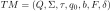
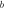

# Turing Machine Simulator
This is a Turing Machine simulator built on Java programming language.

This is a project for the subject **Computational Complexity** 
of the Computer Engeneering degree 
at [La Laguna University](https://www.ull.es).

## Introduction
An *automaton* is formal machine, whose function is to determine if 
a string is contained in a certain type of formal language.

Formally, an automaton is built of states and transitions. Each state
represents where is the automaton in the processing of the
input string.

In the study of *abstract machines*, which is a subject of discrete maths
and computer science, it exists a wel-known classification of automatons
and formal languages that could recognize each automaton. 
This classification is called **Chomsky Hierarchy**.

| Grammar |        Language        |                    Automaton                    |
|:-------:|:----------------------:|:-----------------------------------------------:|
|  Type-0 | Recursively enumerable |                  Turing machine                 |
|  Type-1 |    Context sensitive   | Linear-bounded non-deterministic Turing machine |
|  Type-2 |      Context free      |                Pushdown automaton               |
|  Type-3 |    Regular language    |               Finite state machine              |


As we can see it exist a classification depending on the expressivity
power of each automaton. Therefore, each language and automaton has 
its own properties and definitions. In this programme we are simulating 
a **Turing Machine**, which is used to recognize strings 
belonging to recursively enumerable languages.

## Definition of a Turing Machine

### Formal description

Formally the Turing Machine is defined as a *7-tuple* 
of elements: 

consist on this elements: 

*  : finite set of states of the Turing machine.
*  : alphabet of the turing machine, 
which is a finite set of symbols.
*  : alphabet of the input tape, 
which is a finite set of symbols.
*  : initial state of the Turing machine.
*  : blank symbol of the tape.
*  : finite set of accepting states.
*  : Transition function of the automaton.


## Usage
### File Format
The file format of the description of the Turing machine
is like this:
```
# this line is a comment
# blank spaces are allowed.

q1 q2 q3 ... # Q set
a1 a2 a3 ... # Σ set
A1 A2 A3 ... # Γ set
q1           # initial state
b            # blank symbol
q2 q3        # F set
n            # number of tapes that the Turing Machine accepts.

q1 a1 a2 ... an q2 b1 b2 ... bn m1 m2 ... mn

# transition function: ​ δ (q1, <a1, a2.., an>) = (q2, <b1, b2, ..., bn>, <m1, m2, ..., mn>)

```

### Execution
For executing the program you should do

```
    Usage: TuringMachine.jar [options]
      Options:
      * -d, --description
          file name containing Turing machine description
        -h, --help
          help description
        -t, --tapes
          file name containing the tapes description.
        -v, --verbose
          trace mode, with specified tape.
          Default: false
```

### Input tape
The tape should have the symbols separated by spaces. 
And each line represents a different tape.

For representing the empty tape is needed a `.`.

```
a1 a2 ...
b1 b2 ...
.           # Empty tape
```


## Example use
This is an example of an execution:

```
TuringMachine.jar --description test/TM1.txt -t test/tapes/TM1Tape1.txt -v
```

```
╔════════════════════════════════╤═══════╤═════════════╤════════════════════════════════╗
║ used transition                │ state │ tapes       │ transitions                    ║
╠════════════════════════════════╪═══════╪═════════════╪════════════════════════════════╣
║ -                              │ q0    │ x x y y z $ │ (q0, [x]) → (q0, [x], [RIGHT]) ║
╟────────────────────────────────┼───────┼─────────────┼────────────────────────────────╢
║ (q0, [x]) → (q0, [x], [RIGHT]) │ q0    │ x y y z $   │ (q0, [x]) → (q0, [x], [RIGHT]) ║
╟────────────────────────────────┼───────┼─────────────┼────────────────────────────────╢
║ (q0, [x]) → (q0, [x], [RIGHT]) │ q0    │ y y z $     │ (q0, [y]) → (q0, [y], [RIGHT]) ║
╟────────────────────────────────┼───────┼─────────────┼────────────────────────────────╢
║ (q0, [y]) → (q0, [y], [RIGHT]) │ q0    │ y z $       │ (q0, [y]) → (q0, [y], [RIGHT]) ║
╟────────────────────────────────┼───────┼─────────────┼────────────────────────────────╢
║ (q0, [y]) → (q0, [y], [RIGHT]) │ q0    │ z $         │ (q0, [z]) → (q1, [z], [RIGHT]) ║
╟────────────────────────────────┼───────┼─────────────┼────────────────────────────────╢
║ (q0, [z]) → (q1, [z], [RIGHT]) │ q1    │ $           │ ω ∈ L                          ║
╚════════════════════════════════╧═══════╧═════════════╧════════════════════════════════╝

Turing machine definition:
Q = {q0, q1}
Σ = {x, y, z}
τ = {x, y, z, ε}
q0 = q0
b = ε
F = {q1}
δ : 
(q0, [x]) → (q0, [x], [RIGHT])
(q0, [y]) → (q0, [y], [RIGHT])
(q0, [z]) → (q1, [z], [RIGHT])

Turing machine evaluation determine that tapes belong to the language.

tapes:
$

Done by: Cristian Abrante
```

## Author

* **Cristian Abrante Dorta** - [CristianAbrante](https://github.com/CristianAbrante)
